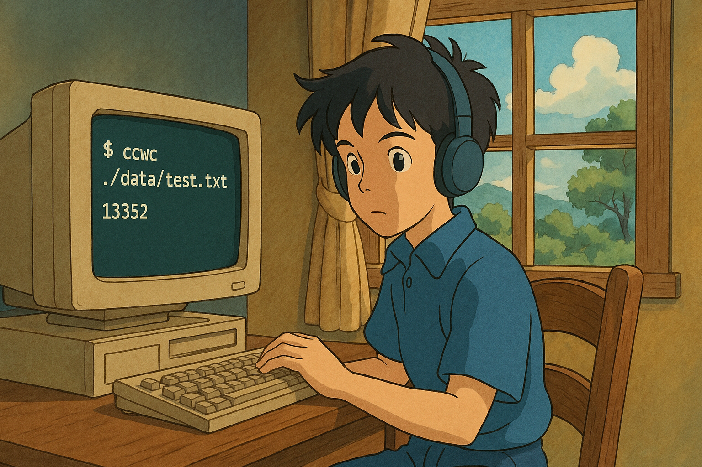

# Build your own wc in go



## Intro

I began learning Go and wanted to work on a project to enhance my skills. I discovered this [build your own wc tool](https://codingchallenges.fyi/challenges/challenge-wc/) challenge and decided to take it on.

## How to run

Make sure you have Go [installed](https://go.dev/doc/install).

Then clone the repo and run `make build` in the root directory.  

Then you can write this command:

```bash 

# Without any flags will show the help message

> ./ccwc 
Usage of ./ccwc:
  -c    print the byte/s count
  -l    print the line count
  -m    print the character count
  -w    print the word count

# Show line count

> ./ccwc -l <file>
791 ./data/test.txt

# Show word count

> ./ccwc -w <file>
10859 ./data/test.txt

# Show character count

> ./ccwc -m <file>
61031 ./data/test.txt

# Show byte count

> ./ccwc -c <file>
61031 ./data/test.txt

# without any flags will show all the counts
# similar to `wc` command
> ./ccwc ./data/test.txt
791 10859 61031 ./data/test.txt

```

## Why Dockerfile

I was curious to see what a Go project Dockerfile looks like; it turns out it's really simple.  

Just build the image and run it:

```bash
docker build -t ccwc .
docker run -it ccwc # or with any flag like above
```

## Project Structure

This section provides an overview of the purpose of the key files in this project:

- **main.go**: The main entry point of the application. It handles command-line arguments, processes the input file or standard input, and prints the results.
- **reader.go**: Contains the `CountLinesWordsBytes` function, which counts the number of lines, words, and bytes in a given file. This function does the most of the work.
- **stdin_util.go**: Contains the `StdinUtil` function, which opens the file provided as a command-line argument or returns the standard input if no file is specified.
- **stat.go**: Contains the `Stat` function, which retrieves and returns the file information for a given file path, including details such as file size, permissions, and modification time. (You can use this instead of `reader.go` file)
- **mem.go**: Contains the `Mem` function, which returns the memory usage of the program. Just put `Mem()` in the beginning and end of the `main` function.
- **reader_test.go**: Contains the tests for the `CountLinesWordsBytes` function.


## Credits

I studied other codes who have completed this challenge in Go. Here is the list:

- [André Brandão](https://github.com/andrenbrandao/wc-tool)
- [PraveshGoyal](https://github.com/praveshdev3/wc-go)
- [Hruthik Reddy Yarala](https://github.com/yaralahruthik/cc-wc)

Also I used project like [lazygit](https://github.com/jesseduffield/lazygit) and [lazydocker](https://github.com/jesseduffield/lazydocker) to help me understand how to use Go in a large scale project.

